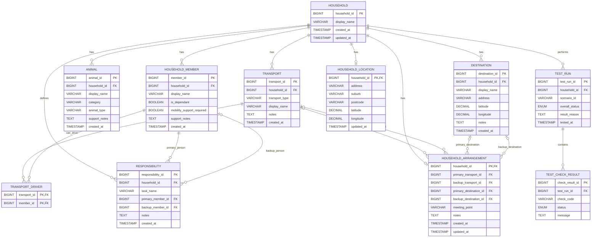

# Iteration 1 Database ERD

This ERD represents the Iteration 1 application database for the FIT5120 FIREBREAK project.

## Relationship Summary

### Household relationships

A household can have:

- many household members
- many animals
- many transport options
- many destinations
- one current household arrangement
- many responsibilities
- one household location
- many preparedness test runs

### Transport and drivers

`transport_driver` is a junction table between:

- `transport`
- `household_member`

This supports a many-to-many relationship because:

- one transport option may have multiple possible drivers
- one household member may be able to drive multiple transport options

### Household arrangements

Each household can have one current `household_arrangement`.

The arrangement may reference:

- one primary transport option
- one backup transport option
- one primary destination
- one backup destination
- one meeting point

The transport and destination references are optional because a household may not have completed every part of its preparedness plan yet.

### Responsibilities

Each responsibility belongs to one household.

A responsibility has:

- one primary household member
- an optional backup household member

Examples include:

- drive the household
- collect pets
- prepare medication
- contact family members

### Household location

Each household can have one current household location.

The latitude and longitude are used by the Data layer to obtain:

- Bushfire Prone Area status
- CFA Fire District
- local Fire History context

Large spatial datasets are not stored in the application database.

### Preparedness testing

A household can have multiple `test_run` records over time.

Each test run can contain multiple `test_check_result` records.

This allows the system to keep a history of preparedness tests and the individual checks that contributed to each test result.

## Iteration Boundary

This ERD contains only the application tables required for Iteration 1.

The following are intentionally not represented as database tables in Iteration 1:

- plan completion status
- immediate preparedness checks
- basic scenario library
- CFA Fire Danger Rating
- BOM weather data
- BPA polygons
- CFA Fire District polygons
- Fire History spatial datasets
- vegetation datasets
- terrain datasets

Plan completion and immediate checks can be calculated by Backend.

The basic scenario library can remain as Backend static configuration.

Live Fire Danger Rating and weather information are obtained from official external sources.

Spatial bushfire context remains in the Data layer.