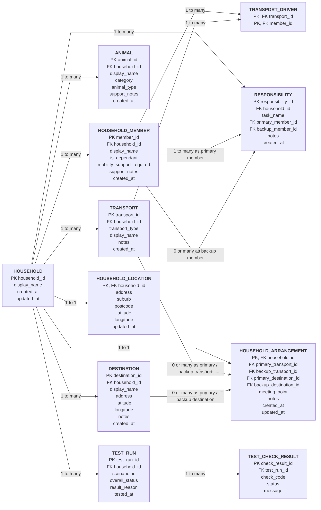

# Iteration 1 Database ERD

This ERD represents the Iteration 1 application database for the FIT5120 FIREBREAK project.

> Notes:
> - This version is simplified for readability.
> - It shows table names, key fields, and relationship types.
> - Data types are intentionally omitted.
> - `transport_driver` is the junction table between `household_member` and `transport`.

## Relationship Summary

- `household` to `household_member`: **one-to-many**
- `household` to `animal`: **one-to-many**
- `household` to `transport`: **one-to-many**
- `household` to `destination`: **one-to-many**
- `household` to `household_arrangement`: **one-to-one**
- `household` to `household_location`: **one-to-one**
- `household` to `responsibility`: **one-to-many**
- `household` to `test_run`: **one-to-many**
- `household_member` to `transport`: **many-to-many via `transport_driver`**
- `test_run` to `test_check_result`: **one-to-many**
- `responsibility.primary_member_id` references one `household_member`
- `responsibility.backup_member_id` optionally references one `household_member`
- `household_arrangement` optionally references:
  - one primary transport
  - one backup transport
  - one primary destination
  - one backup destination